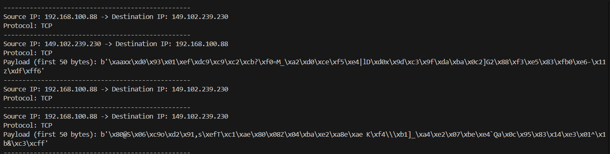

# 🛰️ Network Packet Sniffer (Scapy)

A simple yet powerful **packet sniffer** built using [Scapy](https://scapy.net/).  
This tool captures live network traffic, extracts useful details, and displays them in a readable format.

---

## 📌 Features
- Captures live network packets in real-time.
- Extracts **Source/Destination IPs**.
- Identifies protocols: **TCP, UDP, ICMP**.
- Displays **payload data (first 50 bytes)** for inspection.
- Lightweight and easy to use with Python.

---

## 📷 Example Output
Below is a sample output from the sniffer:



---

## ⚙️ Installation & Usage

### 1. Install dependencies

pip install scapy


> ⚠️ On Windows, make sure you have **Npcap** installed:
> [Download Npcap](https://nmap.org/npcap/)

### 2. Run the sniffer


python sniffer.py

---

## 📂 Project Structure

├── sniffer.py        # Main Python script
├── demo.png          # Screenshot of output
└── README.md         # Documentation

---

## 🚀 Future Improvements

* Save packets to a `.pcap` file (Wireshark-compatible).
* Add filtering (e.g., capture only HTTP or DNS traffic).
* GUI visualization for real-time monitoring.

---

## 📜 License

This project is licensed under the **MIT License** – feel free to use, modify, and share.

---

👩‍💻 **Internship Project** – developed as part of hands-on learning in network security and packet analysis.

```

